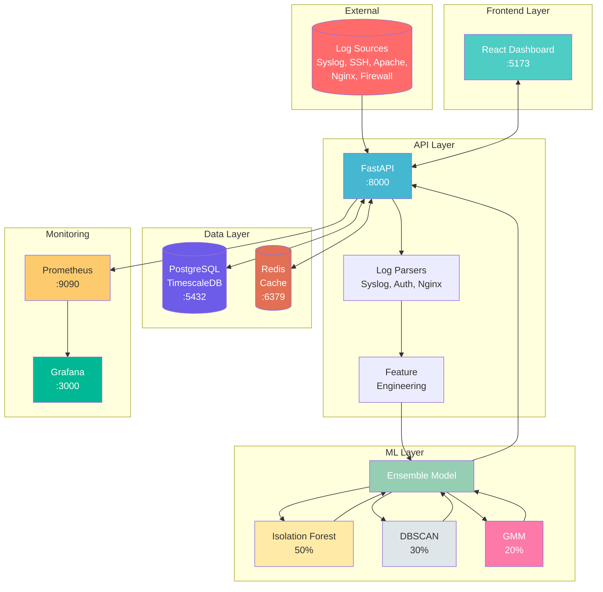
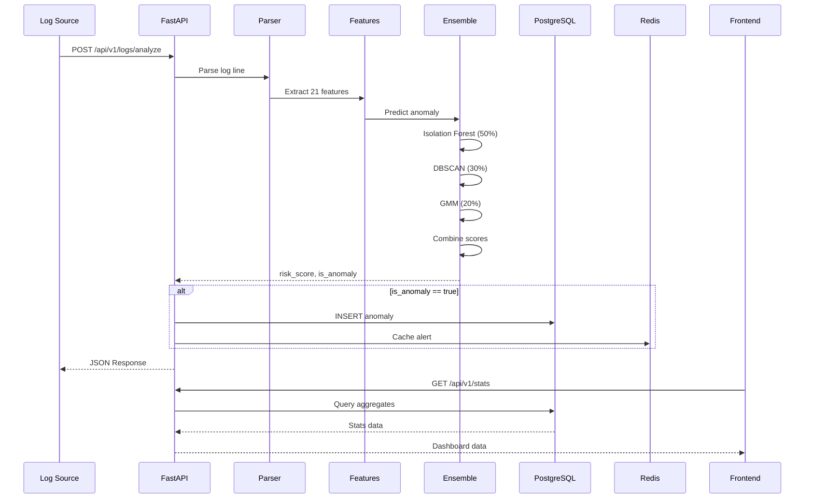
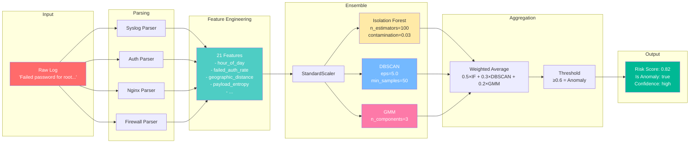
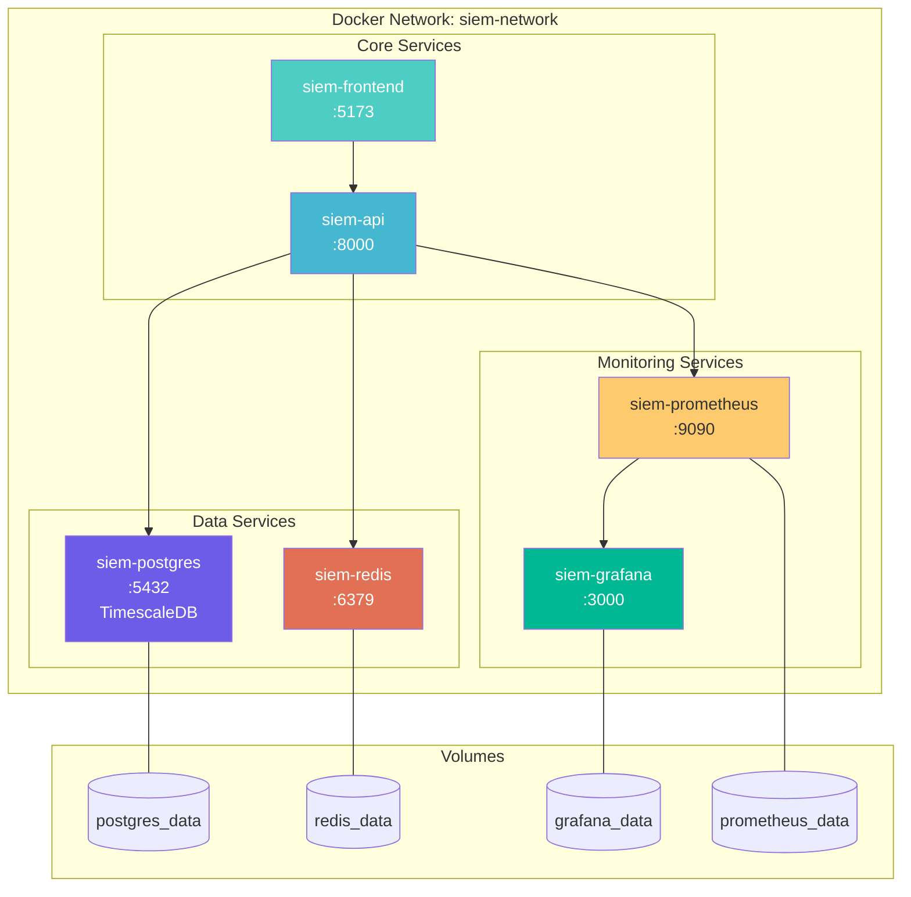
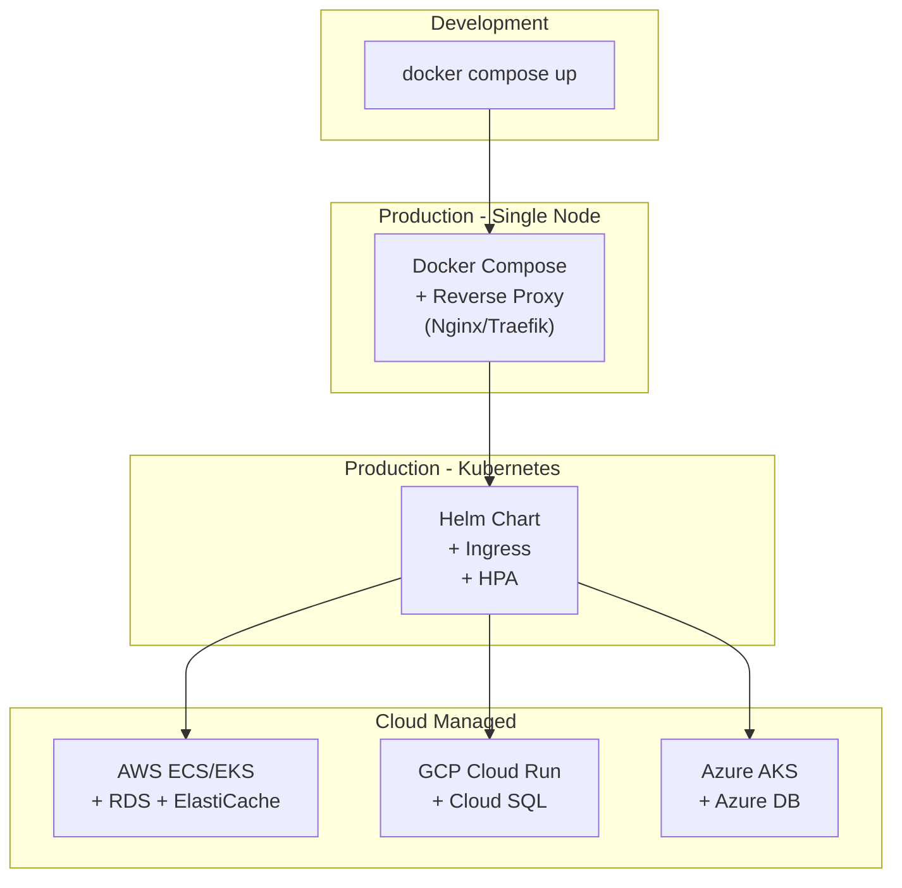

# SIEM Anomaly Detector - Architecture

## System Overview

```
                                    SIEM ANOMALY DETECTOR
    ============================================================================
    
                                   +------------------+
                                   |   Log Sources    |
                                   +------------------+
                                   | - Syslog         |
                                   | - Auth (SSH)     |
                                   | - Apache/Nginx   |
                                   | - Firewall       |
                                   | - Custom         |
                                   +--------+---------+
                                            |
                                            v
    +------------------+           +------------------+           +------------------+
    |     Frontend     |           |      API         |           |    Monitoring    |
    +------------------+   REST    +------------------+           +------------------+
    | React + TS       |<--------->| FastAPI          |           | Prometheus :9090 |
    | Vite             |   :8000   | Async/Await      |---------->| Grafana    :3000 |
    | Dashboard        |           | Structlog        |  metrics  |                  |
    | Recharts         |           +--------+---------+           +------------------+
    | :5173            |                    |
    +------------------+                    |
                                            v
                              +---------------------------+
                              |      ML Ensemble          |
                              +---------------------------+
                              |                           |
                              |  +---------------------+  |
                              |  | Isolation Forest    |  |
                              |  | (50% weight)        |  |
                              |  +---------------------+  |
                              |            +              |
                              |  +---------------------+  |
                              |  | DBSCAN              |  |
                              |  | (30% weight)        |  |
                              |  +---------------------+  |
                              |            +              |
                              |  +---------------------+  |
                              |  | GMM                 |  |
                              |  | (20% weight)        |  |
                              |  +---------------------+  |
                              |            |              |
                              |            v              |
                              |    Final Risk Score       |
                              |    (0.0 - 1.0)            |
                              +-------------+-------------+
                                            |
                              +-------------+-------------+
                              |                           |
                              v                           v
                    +------------------+       +------------------+
                    |   PostgreSQL     |       |      Redis       |
                    +------------------+       +------------------+
                    | TimescaleDB      |       | Cache            |
                    | Anomalies Table  |       | Rate Limiting    |
                    | Logs Table       |       | Session Data     |
                    | Alerts Table     |       | :6379            |
                    | :5432            |       +------------------+
                    +------------------+
```

---

## Component Diagram (Mermaid)



---

## Data Flow Diagram



---

## ML Ensemble Architecture



---

## Docker Services Architecture



---

## Feature Categories

```
+------------------------------------------+
|           21 FEATURES EXTRACTED          |
+------------------------------------------+
|                                          |
|  TEMPORAL (4)                            |
|  ├─ hour_of_day (0-23)                   |
|  ├─ day_of_week (0-6)                    |
|  ├─ is_weekend (0/1)                     |
|  └─ is_business_hours (0/1)              |
|                                          |
|  FREQUENCY (4)                           |
|  ├─ login_attempts_per_minute            |
|  ├─ requests_per_second                  |
|  ├─ unique_ips_last_hour                 |
|  └─ unique_endpoints_accessed            |
|                                          |
|  RATES (3)                               |
|  ├─ failed_auth_rate                     |
|  ├─ error_rate_4xx                       |
|  └─ error_rate_5xx                       |
|                                          |
|  GEOGRAPHIC (3)                          |
|  ├─ geographic_distance_km               |
|  ├─ is_known_country (0/1)               |
|  └─ is_known_ip (0/1)                    |
|                                          |
|  BEHAVIORAL (4)                          |
|  ├─ bytes_transferred                    |
|  ├─ time_since_last_activity_sec         |
|  ├─ session_duration_sec                 |
|  └─ payload_entropy                      |
|                                          |
|  CONTEXT (3)                             |
|  ├─ is_privileged_user (0/1)             |
|  ├─ is_sensitive_endpoint (0/1)          |
|  └─ is_known_user_agent (0/1)            |
|                                          |
+------------------------------------------+
```

---

## Ports Reference

| Service | Port | Protocol | Description |
|---------|------|----------|-------------|
| Frontend | 5173 | HTTP | React Dashboard |
| API | 8000 | HTTP | FastAPI REST API |
| PostgreSQL | 5432 | TCP | TimescaleDB Database |
| Redis | 6379 | TCP | Cache & Rate Limiting |
| Prometheus | 9090 | HTTP | Metrics Collection |
| Grafana | 3000 | HTTP | Monitoring Dashboards |

---

## Technology Stack

```
+------------------+------------------+------------------+
|     FRONTEND     |     BACKEND      |   INFRASTRUCTURE |
+------------------+------------------+------------------+
| React 18         | Python 3.10+     | Docker           |
| TypeScript       | FastAPI          | Docker Compose   |
| Vite             | SQLAlchemy       | PostgreSQL 15    |
| Recharts         | AsyncPG          | TimescaleDB      |
| CSS3             | Pydantic v2      | Redis            |
|                  | Structlog        | Prometheus       |
|                  | scikit-learn     | Grafana          |
|                  | NumPy/Pandas     |                  |
+------------------+------------------+------------------+
```

---

## Security Boundaries

```
    EXTERNAL                    DMZ                         INTERNAL
    ========                    ===                         ========
    
    +--------+            +------------+              +---------------+
    | Logs   |  --------> | API :8000  | -----------> | PostgreSQL    |
    | (Any   |    REST    | (Validates |    SQL       | (Encrypted)   |
    | Source)|            |  & Parses) |              +---------------+
    +--------+            +------------+                     ^
                                |                            |
    +--------+            +------------+              +---------------+
    | Users  |  --------> | Frontend   | -----------> | Redis         |
    | (SOC   |   HTTPS    | :5173      |   Cache      | (Auth)        |
    | Analyst|            | (Auth*)    |              +---------------+
    +--------+            +------------+
    
    * Authentication: TODO (JWT planned)
```

---

## Deployment Options



---

## File Structure

```
SIEM-Anomaly-Detector-ML/
├── backend/
│   ├── api/routes/          # REST endpoints
│   ├── db/                  # Database models & CRUD
│   ├── ml/                  # ML ensemble & features
│   ├── parsers/             # Log parsers
│   ├── main.py              # FastAPI app
│   └── config.py            # Settings
├── frontend/
│   ├── src/
│   │   ├── components/      # React components
│   │   ├── services/        # API client
│   │   └── App.tsx          # Main app
│   └── vite.config.ts
├── docs/
│   ├── ARCHITECTURE.md      # This file
│   └── ML_ARCHITECTURE.md   # ML details
├── scripts/
│   ├── train_ensemble.py    # Model training
│   └── retrain_from_production.py
├── monitoring/
│   ├── prometheus.yml
│   └── grafana/
├── docker-compose.yml       # Full stack
└── README.md
```

---

*Last updated: January 14, 2026*
